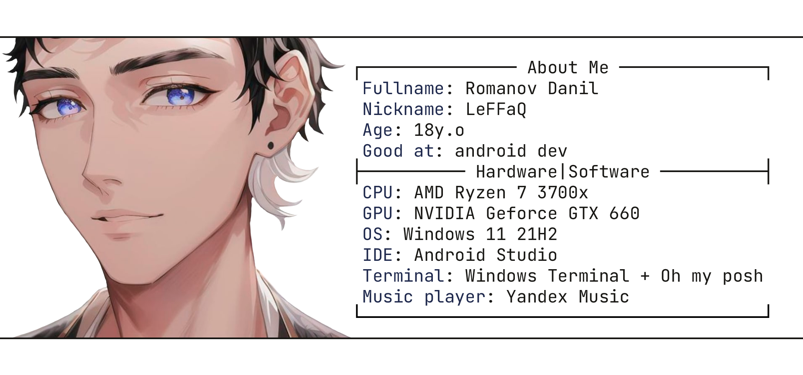

<picture>
 <source media="(prefers-color-scheme: dark)" srcset="images/hi-there-dark.svg">
 <source media="(prefers-color-scheme: light)" srcset="images/hi-there-light.svg">
 
</picture>

  
  
  
  

<!--
<picture>
 <source media="(prefers-color-scheme: dark)" srcset="images/linebreak-dark.png">
 <source media="(prefers-color-scheme: light)" srcset="images/linebreak-light.png">
 
</picture> 
-->

  <picture>
    <source media="(prefers-color-scheme: dark)" srcset="images/avatar-image-dark.png">
    <source media="(prefers-color-scheme: light)" srcset="images/avatar-image-light.png">
    
  </picture>
  
Image: AI-generated from
      <a href="https://h5.tu.qq.com/web/ai-2d/cartoon/index?parent_trace_id=cf36d024-cafe-039e-ff60-51afd70cd26a&root_channel=qq_sousuo&current_channel=imageQRCode&level=11">here,</a>
      not me actually :)
  

<picture>
 <source media="(prefers-color-scheme: dark)" srcset="images/linebreak-dark.png">
 <source media="(prefers-color-scheme: light)" srcset="images/linebreak-light.png">
 
</picture> 

  <picture>
    <source media="(prefers-color-scheme: dark)" srcset="images/toolchain-dark.svg">
    <source media="(prefers-color-scheme: light)" srcset="images/toolchain-light.svg">
    
  </picture>

  <code></code>&nbsp;
  <code></code>&nbsp;
  <code></code>&nbsp;
  <code></code>&nbsp;
  <code></code>&nbsp;
  <code></code>&nbsp;
  <code></code>&nbsp;
  <code></code>&nbsp;

<picture>
 <source media="(prefers-color-scheme: dark)" srcset="images/linebreak-dark.png">
 <source media="(prefers-color-scheme: light)" srcset="images/linebreak-light.png">
 
</picture> 

## Stats

<h2 align='center'>UNDER CONSTRACTION</h2>
 

 <!--Components with theme switcher-->

 <!-- Linebreak
<picture>
 <source media="(prefers-color-scheme: dark)" srcset="images/linebreak-dark.png">
 <source media="(prefers-color-scheme: light)" srcset="images/linebreak-light.png">
 
</picture> 
  Linebreak -->